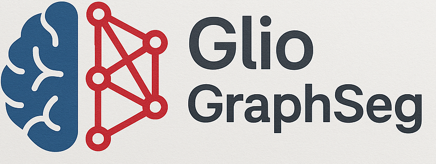

# GlioGraphSeg

GlioGraphSeg is a deep learning-based tool for brain tumor segmentation from MRI scans.
It uses Graph Neural Networks to model spatial relationships between regions.
The system provides accurate glioma detection and segmentation.

---

---

## Try the Streamlit App

👉 [Access GlioGraphSeg here](https://gliographseg.streamlit.app)

---

## Description

GlioGraphSeg combines deep learning and graph-based modeling to improve the segmentation of gliomas in brain MRI scans.  
The tool is designed to support medical professionals by providing accurate, automated tumor delineation using GNNs.

---

## Citation

If you use GlioGraphSeg in your research, please cite the following paper:

> Amato, D., Calderaro, S., Bosco, G. L., Rizzo, R., & Vella, F. (2024, December). Semantic Segmentation of Gliomas on Brain MRIs by Graph Convolutional Neural Networks. In 2024 International Conference on AI x Data and Knowledge Engineering (AIxDKE) (pp. 143-149). IEEE.
> [DOI link](https://ieeexplore.ieee.org/abstract/document/10990089)

---

## Contact

For questions or collaborations, contact: [salvatore.calderaro01@unipa.it](mailto:salvatore.calderaro01@unipa.it)
